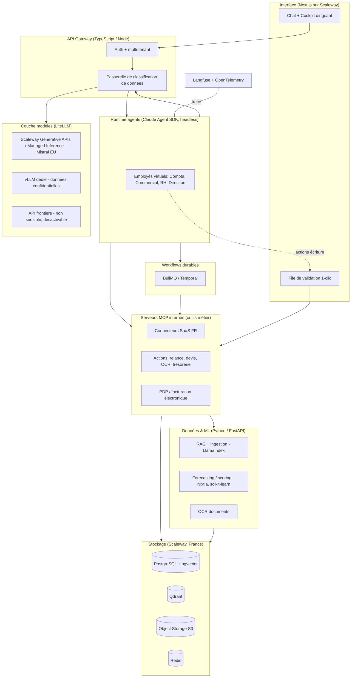

# Blueprint technique — Assistant IA souverain pour PME françaises (V2 complète)

> Document d'architecture et plan de construction de bout en bout.
> Stack : **hybride TypeScript + Python**, **100 % cloud souverain (France/UE), sans box**.
> Destiné à être déroulé avec **Claude Code** + le **Claude Agent SDK**.
> Version 1.0 — prix & outils 2026.

---

## 0. Comment utiliser ce document avec Claude Code

Ce fichier est fait pour vivre **à la racine de ton repo**. Le plan de travail (§9) est découpé en phases et en tickets que tu donnes à Claude Code un par un.

1. Crée le repo, dépose ce fichier, puis crée le `CLAUDE.md` (§10.1) — c'est lui que Claude Code lit à chaque session.
2. Configure les sous-agents et skills (§10.2–10.3) : ils encodent tes procédures répétitives (créer un connecteur, écrire un outil MCP, revoir la conformité RGPD).
3. Travaille en boucle **plan → test → code → vérif** (§10.6), un ticket à la fois, en `git worktree` pour les features parallèles.
4. Ne laisse jamais un agent exécuter une action « écriture/envoi » sans validation humaine — c'est câblé par des *hooks* (§10.5).

> **Principe directeur produit** : on ne vend pas « une IA qu'on interroge » mais « un employé qui exécute ». Chaque action sensible est **préparée par l'IA, validée en 1 clic par le dirigeant**. La confiance avant l'autonomie.

---

## 1. Principes d'architecture

| # | Principe | Conséquence technique |
|---|----------|----------------------|
| 1 | **Souveraineté par défaut** | Toute donnée client réside en France/UE (Scaleway). Aucun appel vers une API hors-UE sans classification explicite. |
| 2 | **Classification avant routage** | Une passerelle étiquette chaque requête (confidentiel / interne / non sensible) et choisit la destination modèle. C'est le cœur défendable du produit. |
| 3 | **Agentique, pas conversationnel** | Chaque « employé virtuel » est un agent (Claude Agent SDK) doté d'outils MCP métier, pas un simple chat RAG. |
| 4 | **Human-in-the-loop sur l'écriture** | Les outils en lecture s'exécutent librement ; les outils d'écriture/envoi passent par une validation. |
| 5 | **Multi-tenant strict** | Isolation des données par `tenant_id`, Row-Level Security Postgres, collections Qdrant par tenant. |
| 6 | **OpenAI-compatible partout** | Scaleway, Mistral EU et un éventuel vLLM local exposent la même API → un seul code, on change l'endpoint via LiteLLM. |
| 7 | **Durable & observable** | Les workflows métier (relances, e-invoicing, forecasting) sont durables (retries) et 100 % tracés (Langfuse). |
| 8 | **Solo-friendly** | Zéro capex, services managés Scaleway, un monorepo, déploiement conteneurs serverless. On évite Kubernetes tant que possible. |

---

## 2. Vue d'ensemble de l'architecture



**Lecture** : la requête entre par l'UI → auth/tenant → **classification** → un employé virtuel (agent) raisonne, appelle des **outils MCP** (connecteurs + actions métier), qui touchent les **données** et le **stockage** en France. Les modèles sont dispatchés par **LiteLLM** selon la classification. Les actions d'écriture passent par la **file de validation**. Tout est tracé par **Langfuse**.

---

## 3. Stack technique complet

### 3.1 Cœur applicatif (TypeScript)

| Couche | Outil | Rôle | Pourquoi |
|--------|-------|------|----------|
| Monorepo | **pnpm workspaces + Turborepo** | Gérer front, API, agents, packages partagés | Rapide, standard TS, cache de build |
| Frontend | **Next.js 15 (App Router) + React + TypeScript** | Chat, cockpit, file de validation | Écosystème mûr ; hébergé sur Scaleway (pas Vercel, pour la souveraineté) |
| UI kit | **Tailwind + shadcn/ui** | Design system | Rapide, propre, pas de dépendance lourde |
| Chat UI | **Vercel AI SDK (UI)** ou `assistant-ui` | Streaming des réponses agent | Compatible SSE, gère l'état de conversation |
| API Gateway | **NestJS** (ou Fastify si tu veux plus léger) | Auth, tenants, classification, orchestration | Structuré, modules, DI — tient la montée en charge en solo |
| Type-safety front↔back | **tRPC** ou **OpenAPI + openapi-typescript** | Contrats typés | Moins de bugs d'intégration |
| Runtime agents | **`@anthropic-ai/claude-agent-sdk`** (headless) | Boucle agentique des employés virtuels | Le SDK qui *est* Claude Code, en mode serveur |
| ORM | **Prisma** (TS) | Accès Postgres côté app | Migrations, typage |
| Workflows | **BullMQ** (démarrage) → **Temporal** (à l'échelle) | Relances, e-invoicing, jobs planifiés, retries | Durable, observable ; BullMQ = Redis, simple pour commencer |
| Automations no-code (option) | **n8n** (self-host) | Automatisations configurables par toi/le client | Utile pour connecter vite sans coder |

### 3.2 Données, RAG & ML (Python)

| Couche | Outil | Rôle | Pourquoi |
|--------|-------|------|----------|
| Runtime Python | **uv** + **FastAPI** | Micro-services data/ML exposés en HTTP | `uv` ultra-rapide ; FastAPI = standard |
| Agent SDK (Python) | **`claude-agent-sdk`** | Si un agent doit vivre côté Python (ML) | Même SDK, version Python |
| RAG / ingestion | **LlamaIndex** (ou LangChain) | Chunking, indexation, requêtes RAG | Le plus complet pour le RAG documentaire |
| Parsing documents | **Docling** + **unstructured** | Contrats, devis, PDF → texte structuré | Gèrent le PDF/Office complexe |
| OCR | **Mistral Document AI (EU)** ou **docTR** (self-host) | Factures fournisseurs → données | Mistral hébergé UE ; docTR si 100 % on-prem souhaité |
| Embeddings | **bge-m3** (self-host) ou **Mistral Embed (EU)** | Vectorisation multilingue FR | Multilingue solide, souverain |
| Forecasting | **Nixtla StatsForecast / MLForecast**, **Prophet** | Ventes, demande, trésorerie | Séries temporelles, rapide, sans GPU |
| Scoring (impayés, churn) | **scikit-learn / XGBoost** | Modèles tabulaires | Léger, explicable |

### 3.3 Modèles & inférence (souverain)

| Élément | Outil | Rôle |
|---------|-------|------|
| Passerelle modèles | **LiteLLM** (proxy self-host) | Unifie tous les fournisseurs derrière une API OpenAI ; budgets, fallback, routage |
| Tier « interne » | **Scaleway Generative APIs** (serverless, UE, OpenAI-compatible) | Mistral / Llama / Qwen + embeddings à l'usage |
| Tier « confidentiel » | **Scaleway Managed Inference** (endpoint dédié) ou **vLLM** sur GPU Scaleway L4 | Isolation ou on-prem logique, données non partagées |
| Alternative UE | **Mistral La Plateforme (EU)** | Second fournisseur souverain (redondance) |
| Tier « non sensible » (option) | API frontière | Uniquement si le client l'autorise ; désactivable |

### 3.4 Plateforme & ops (Scaleway, France)

| Couche | Outil |
|--------|-------|
| Base relationnelle | **PostgreSQL** (Scaleway Managed DB) + extension **pgvector** |
| Base vectorielle | **pgvector** au début → **Qdrant** (self-host) à l'échelle |
| Cache / files | **Redis** (Scaleway) |
| Stockage objets | **Scaleway Object Storage** (S3-compatible) |
| Auth | **better-auth** ou **Auth.js** (léger) → **Keycloak** (self-host) si SSO/RBAC B2B avancé |
| Secrets | **Scaleway Secret Manager** (ou Infisical self-host) |
| Observabilité LLM | **Langfuse** (self-host) — traces agents, coûts, évals |
| Observabilité app | **OpenTelemetry** + **Grafana/Prometheus** ; **Sentry** (région UE) pour les erreurs |
| IaC | **Terraform** (provider Scaleway) |
| CI/CD | **GitHub Actions** (ou **GitLab CI** si tu veux un repo hébergé UE) |
| Conteneurs | **Docker** → **Scaleway Serverless Containers** (simple) → **Kubernetes Kapsule** (si besoin) |

---

## 4. Structure du monorepo

```
sovereign-ai-pme/
├── CLAUDE.md                      # instructions Claude Code (voir §10.1)
├── blueprint-technique-v2.md      # ce document
├── .claude/
│   ├── agents/                    # sous-agents (§10.2)
│   ├── skills/                    # slash-commands / procédures (§10.3)
│   ├── settings.json              # permissions équipe (§10.4)
│   └── settings.local.json        # overrides perso (gitignored)
├── .mcp.json                      # serveurs MCP de dev (§10.4)
├── apps/
│   ├── web/                       # Next.js (front)
│   ├── api/                       # NestJS (gateway + classification + auth)
│   └── agent-runtime/             # service Node : Claude Agent SDK headless
├── services/                      # Python (uv)
│   ├── rag/                       # ingestion + RAG (FastAPI + LlamaIndex)
│   ├── ml/                        # forecasting + scoring (FastAPI)
│   └── ocr/                       # OCR factures (FastAPI)
├── mcp-servers/                   # serveurs MCP internes (outils métier)
│   ├── connectors/                # Pennylane, Qonto, Sage, Sellsy...
│   ├── actions/                   # relance, devis, trésorerie...
│   └── einvoice/                  # PDP / facturation électronique
├── packages/
│   ├── shared/                    # types, schémas Zod, contrats tRPC
│   ├── classifier/                # passerelle de classification (lib)
│   └── llm/                       # config LiteLLM, prompts, garde-fous
├── infra/                         # Terraform (Scaleway)
└── ops/                           # docker-compose local, scripts, seeds
```

---

## 5. Composants détaillés

### 5.1 Passerelle de classification & routage (le cœur)

**Rôle** : à chaque requête (ou appel d'outil produisant un payload), déterminer la **catégorie de sensibilité** et router vers le bon tier modèle, en journalisant la décision (audit RGPD).

- **Catégories** : `confidentiel` (paie, contrats, données clients nominatives, pièces comptables), `interne` (documents internes, e-mails), `non_sensible` (rédaction générale, code public).
- **Méthode** : règles déterministes d'abord (patterns : IBAN, NIR, mots-clés « bulletin de paie », présence de PII détectée par un NER FR), puis un **petit classifieur LLM** (Ministral/Small sur Scaleway) en cas de doute.
- **Politique** : table de routage `catégorie → tier modèle autorisé`. `confidentiel` ne sort **jamais** du tier souverain ; `non_sensible` peut aller au tier frontière **si** le tenant l'a activé.
- **Implémentation** : `packages/classifier` (TS) exposé en middleware de l'API + réutilisé par le runtime agent. Chaque décision est loggée (`tenant_id`, catégorie, tier, hash du contenu — jamais le contenu en clair).
- **Garde-fou** : un `PreToolUse`-équivalent côté runtime refuse tout appel modèle dont le tier ne correspond pas à la catégorie.

### 5.2 Couche modèles & inférence

- **LiteLLM** en proxy : déclare des « model groups » (`sovereign-fast` → Scaleway Ministral, `sovereign-strong` → Mistral Large EU, `confidential` → endpoint Managed Inference dédié, `frontier` → optionnel). Le classifieur choisit le group ; LiteLLM gère fallback, budgets, et l'observabilité tokens.
- **Embeddings** : endpoint dédié (bge-m3 self-host sur un petit conteneur GPU, ou Mistral Embed EU). Toujours souverain (les embeddings encodent la donnée client).
- **Confidentiel** : soit Managed Inference (endpoint dédié, données non mutualisées), soit un **vLLM** sur GPU Scaleway L4 (0,79 €/h) allumé à la demande pour les charges lourdes isolées.

### 5.3 Couche RAG & ingestion (`services/rag`)

- **Pipeline** : upload → Object Storage → parsing (Docling/unstructured) → chunking (par structure documentaire) → embeddings → upsert dans pgvector/Qdrant (collection par tenant) → métadonnées dans Postgres.
- **Requête** : hybrid search (vecteur + BM25) → reranking → contexte passé à l'agent.
- **Employés virtuels par département** : chaque « employé » (Compta, Juridique, RH, Direction, Support) a un filtre de collection + un prompt système spécialisé.
- **Fraîcheur** : ingestion incrémentale déclenchée par webhook des connecteurs (nouveau document Pennylane, nouveau contrat…).

### 5.4 Couche orchestration & agents (`apps/agent-runtime`)

- **Base** : `@anthropic-ai/claude-agent-sdk` en **mode headless**. Un service Node expose une API (SSE) que le front consomme. On capture le `session_id` (message `init`) et on le **persiste par conversation** (reprise de contexte).
- **Un employé virtuel = une config d'agent** : system prompt + sous-ensemble d'outils MCP + `permissionMode` + garde-fous.
- **Outils** : fournis via `mcpServers` (les serveurs MCP internes de `mcp-servers/`).
- **Human-in-the-loop** : les outils d'écriture (`send_relance`, `submit_invoice`, `send_email`, `create_devis`) sont marqués « à valider » → le runtime crée une entrée dans la **file de validation** au lieu d'exécuter, et attend l'action 1-clic du dirigeant.
- **Durabilité** : les tâches longues/planifiées (relances récurrentes, soumission e-invoice, recalcul forecast) sont des **workflows BullMQ/Temporal** qui invoquent l'agent ou directement les outils.

### 5.5 Serveurs MCP internes (`mcp-servers/`)

On expose toute la logique métier comme **outils MCP**, ce qui les rend réutilisables par l'agent, testables isolément, et remplaçables.

- `connectors/` : un serveur MCP par SaaS (voir §5.6). Outils en **lecture** (`get_invoices`, `get_bank_transactions`, `get_contacts`) et **écriture** (`create_invoice`, `push_journal_entry`).
- `actions/` : outils métier composites — `compute_treasury_forecast`, `draft_dunning` (relance), `ocr_and_book_invoice`, `generate_quote_from_email`, `detect_grants` (aides), `margin_by_dimension`.
- `einvoice/` : `format_facturx`, `submit_via_pdp`, `poll_invoice_status` (voir §5.7).

> Implémentés en **SDK MCP servers** (in-process) pour les outils rapides, ou en **serveurs MCP autonomes** (HTTP) pour ceux qui appellent les services Python (RAG/ML/OCR).

### 5.6 Connecteurs SaaS français

Le vrai moat. Priorité aux systèmes de référence des PME et de leurs experts-comptables.

| Connecteur | API | Priorité |
|------------|-----|----------|
| **Pennylane** | REST, bonne API | MVP |
| **Qonto** | REST (banque/facturation) | MVP |
| **Sellsy** | REST (CRM/facturation) | V1 |
| **Sage / EBP** | API plus fermées, parfois fichiers | V1 |
| **Axonaut** | REST | V1 |
| **Silae** (paie) | API partenaire | V2 |

- Chaque connecteur = OAuth/API-key stockée chiffrée (Secret Manager) par tenant, un client typé, et un serveur MCP qui l'expose.
- **Webhooks** entrants → déclenchent ingestion RAG et workflows (nouvelle facture, nouveau paiement).

### 5.7 Facturation électronique / PDP (`mcp-servers/einvoice`)

- **On ne devient pas PDP** (agrément lourd). On **s'intègre à une PDP agréée** via son API.
- Outils : générer du **Factur-X** (PDF/A-3 + XML CII), transmettre via la PDP, suivre le statut (`reçue / rejetée / payée`), gérer l'**e-reporting**.
- Calendrier à respecter : **réception obligatoire 01/09/2026** (toutes entreprises), **émission PME/TPE 01/09/2027**. → chantier à **amorcer tôt** même si la feature sort en V1.

### 5.8 Frontend (`apps/web`)

- **Cockpit dirigeant** : KPIs (trésorerie, marge, ventes), interrogeable en langage naturel (l'agent traduit la question en appels d'outils + requêtes).
- **File de validation** : liste des actions préparées par les agents à valider en 1 clic (relances, devis, écritures, factures).
- **Chat par employé virtuel** + espace documents (upload → RAG).
- **Admin tenant** : connecteurs, politique de classification (activer/désactiver le tier frontière), utilisateurs & rôles.

### 5.9 Auth, multi-tenant & sécurité applicative

- **Multi-tenant** : `tenant_id` sur toutes les tables ; **Row-Level Security** Postgres ; collections Qdrant nommées par tenant ; secrets connecteurs isolés par tenant.
- **RBAC** : rôles `dirigeant`, `collaborateur`, `expert_comptable` (accès délégué — clé de ta distribution).
- **Auth** : better-auth/Auth.js pour démarrer ; Keycloak si tu veux du SSO et de la délégation cabinet comptable propre.

### 5.10 Observabilité & évals

- **Langfuse** : trace chaque run d'agent (prompt, outils, tokens, coût, latence), par tenant. Base des évals de qualité (le point faible des concurrents « box »).
- **Évals** : jeux de tests par workflow (relance correcte ? forecast dans la fourchette ? classification juste ?) exécutés en CI.
- **Alerting** : erreurs (Sentry UE), budgets tokens (LiteLLM), échecs de workflow (Temporal/BullMQ).

---

## 6. Modèle de données (extrait)

- `tenants`, `users`, `memberships(role)`
- `connectors(tenant_id, type, credentials_ref, status)`
- `documents(tenant_id, source, object_key, dept, hash, indexed_at)`
- `embeddings` (pgvector) / collections Qdrant par tenant
- `classifications(tenant_id, request_id, category, tier, decided_by, created_at)` — **audit RGPD**
- `agent_runs(tenant_id, employee, session_id, cost, tokens, status)`
- `pending_actions(tenant_id, type, payload, status, validated_by, validated_at)` — file de validation
- `invoices`, `treasury_snapshots`, `forecasts`, `scores` (impayés/churn)

Tout est **chiffré au repos** (Scaleway) ; les credentials connecteurs et PII sensibles chiffrés au niveau applicatif (enveloppe via Secret Manager).

---

## 7. Sécurité, RGPD & souveraineté

- **Localisation** : toutes les ressources en région Scaleway **FR-PAR**. Cibler un hébergement **SecNumCloud** comme argument commercial.
- **Registre & DPA** : tu es sous-traitant RGPD de tes clients → **contrat de traitement (DPA)** type, registre des traitements, politique de rétention.
- **Minimisation** : la classification logge des **hash**, jamais le contenu ; les prompts sensibles ne partent jamais au tier frontière.
- **Chiffrement** : TLS partout, at-rest activé, secrets hors du code (Secret Manager), rotation des clés connecteurs.
- **Isolation tenant** : RLS + tests d'isolation automatisés (un tenant ne peut jamais lire un autre — à couvrir par un sous-agent de revue sécurité, §10.2).
- **Traçabilité** : chaque action d'écriture est attribuée à un humain validateur (file de validation) — protège juridiquement.

---

## 8. Cartographie features V2 → modules

| Feature (roadmap) | Phase | Modules impliqués |
|-------------------|-------|-------------------|
| RAG documentaire par département | MVP | `services/rag`, agent-runtime, web |
| Relance intelligente d'impayés | MVP | `actions/draft_dunning`, `ml` (scoring), connectors, validation |
| Prévision de trésorerie | MVP | `actions/compute_treasury_forecast`, connectors (Qonto/Pennylane), `ml` |
| OCR factures → compta | MVP | `services/ocr`, `actions/ocr_and_book_invoice`, connectors |
| Facturation électronique (PDP) | V1 | `mcp-servers/einvoice`, workflows |
| Cockpit conversationnel | V1 | agent-runtime, web, classifier |
| Détection d'aides & subventions | V1 | `actions/detect_grants` (RAG sur base d'aides + règles) |
| Génération de devis (e-mail) | V1 | `actions/generate_quote_from_email`, connectors |
| Marge temps réel | V1 | `ml`/SQL, connectors, cockpit |
| Échéancier fiscal & social · CR réunions · rapport auto | V1 | workflows, agent-runtime, `services` |
| CRM + prospection / relance | V1 | connectors, actions, workflows |
| Forecasting ventes / demande | V2 | `ml` (Nixtla) |
| Suivi stocks + alertes · prix matières 1ères + scénarios | V2 | connectors, `ml`, workflows, cockpit |
| Prédiction churn / upsell | V2 | `ml` (scoring), CRM connector |
| Plannings RH · perf horaire | V2 | `ml`/solveur, connectors RH |
| Veille réglementaire · e-réputation · RGPD | V2 | `services/rag` + sources externes, agent-runtime |

---

## 9. Plan de build de A à Z

> Chaque phase = un jalon livrable. Les tickets `[]` sont des unités à donner à Claude Code.

### Phase 0 — Fondations (semaine 1–2)
- [ ] Init monorepo (pnpm + Turborepo), `CLAUDE.md`, `.claude/`, `.mcp.json`.
- [ ] `docker-compose` local : Postgres+pgvector, Redis, Qdrant, LiteLLM, Langfuse.
- [ ] Infra Terraform Scaleway (VPC, Managed PG, Object Storage, Secret Manager, Container Registry).
- [ ] CI (GitHub Actions) : lint (ESLint/ruff), typecheck (tsc/mypy), tests, build images.
- [ ] Auth + modèle multi-tenant + RLS + tests d'isolation.

### Phase 1 — MVP « trésorerie qui exécute » (mois 1–4)
- [ ] LiteLLM + classifieur (règles + fallback LLM) + politique de routage + audit.
- [ ] Connecteurs **Pennylane** + **Qonto** (lecture) en serveurs MCP.
- [ ] `services/rag` : ingestion + RAG documentaire ; employé « Compta/Direction ».
- [ ] `services/ocr` + `actions/ocr_and_book_invoice`.
- [ ] `actions/compute_treasury_forecast` (30/60/90 j).
- [ ] `ml` : scoring risque d'impayé ; `actions/draft_dunning`.
- [ ] File de validation 1-clic (UI + `pending_actions`).
- [ ] Cockpit v0 + chat streaming ; Langfuse branché.
- [ ] **Démarrer en parallèle le partenariat PDP** (contractualisation, accès API sandbox).

### Phase 2 — V1 « co-pilote du dirigeant » (mois 4–10)
- [ ] `mcp-servers/einvoice` : Factur-X + soumission via PDP + statut + e-reporting.
- [ ] Cockpit conversationnel (NL → outils/SQL) consolidé.
- [ ] `actions/detect_grants` (aides & subventions).
- [ ] `actions/generate_quote_from_email` + marge temps réel.
- [ ] Connecteurs **Sage/EBP/Sellsy/Axonaut** (lecture + écriture ciblée).
- [ ] Échéancier fiscal & social, CR de réunion → CRM, rapport mensuel auto.
- [ ] CRM + prospection/relance ; workflows durables (Temporal si complexité).

### Phase 3 — V2 « prédictif & sectoriel » (mois 10+)
- [ ] Forecasting ventes/demande (Nixtla), branché au cockpit + scénarios.
- [ ] Suivi stocks + alertes ; **prix matières premières temps réel** + simulation.
- [ ] Prédiction churn / signaux d'achat / upsell.
- [ ] Plannings RH + prévision besoins ; suivi performance horaire.
- [ ] Veille réglementaire sectorielle ; e-réputation ; assistant RGPD.
- [ ] Modules activables **par vertical** (industrie/BTP, retail, négoce, services).

### Transverse (en continu)
- [ ] Évals de qualité par workflow en CI ; hardening sécurité/RGPD ; docs ; monitoring coûts.

---

## 10. Intégration Claude Code — workflow de développement

### 10.1 `CLAUDE.md` (racine) — squelette recommandé

```markdown
# Assistant IA souverain PME — contexte projet

## Stack
- Monorepo pnpm + Turborepo. TS: apps/ (web Next.js, api NestJS, agent-runtime).
- Python (uv): services/ (rag, ml, ocr). Outils métier: mcp-servers/.
- Data: PostgreSQL+pgvector, Qdrant, Redis, Object Storage (Scaleway FR-PAR).
- Modèles via LiteLLM. Agents via @anthropic-ai/claude-agent-sdk.

## Commandes
- Dev: `pnpm dev` | Tests: `pnpm test` / `uv run pytest`
- Lint: `pnpm lint` / `ruff check` | Types: `pnpm typecheck` / `mypy`
- Migrations: `pnpm prisma migrate dev`

## Règles NON négociables
- Souveraineté: aucune donnée `confidentiel` ne sort du tier souverain. Toujours
  passer par packages/classifier ; jamais d'appel LLM en direct.
- Multi-tenant: toute requête DB filtre par tenant_id (RLS). Écrire un test
  d'isolation pour toute nouvelle table.
- Human-in-the-loop: tout outil d'écriture/envoi crée une pending_action, il
  n'exécute jamais directement.
- Secrets: jamais en clair, jamais commités. Lire via Secret Manager.
- Style: TS strict, Zod pour toute frontière ; Python typé + mypy.

## Gotchas
- Les serveurs MCP d'écriture doivent déclarer `requiresValidation: true`.
- Ne pas appeler les services Python depuis le front : passer par l'API.
```

### 10.2 Sous-agents (`.claude/agents/*.md`)

Fichiers Markdown + frontmatter YAML (`name`, `description`, `tools`, `model`, `effort`…). Recommandés :

| Sous-agent | Rôle | Modèle |
|------------|------|--------|
| `connector-builder` | Générer un connecteur SaaS + serveur MCP à partir d'une doc d'API | opus/sonnet |
| `mcp-tool-author` | Écrire un nouvel outil MCP (schéma Zod, tests, garde-fous validation) | sonnet |
| `rgpd-security-reviewer` | Auditer une PR : isolation tenant, fuite PII, respect du routage souverain | opus, effort high |
| `test-runner` | Lancer et résumer les tests, isoler les échecs (contexte verbeux) | haiku |
| `rag-evaluator` | Évaluer la qualité RAG/forecast sur les jeux d'éval | sonnet |
| `migration-writer` | Écrire migrations Prisma/SQL + test d'isolation RLS | sonnet |

### 10.3 Skills / slash-commands (`.claude/skills/*.md`)

Procédures répétables invoquées par `/nom` :
- `/new-connector <saas>` — scaffold client typé + serveur MCP + tests + doc.
- `/new-mcp-tool <domaine>` — nouvel outil (lecture ou écriture-à-valider).
- `/new-employe-virtuel <dept>` — config agent (prompt, outils, permissions).
- `/rgpd-review` — checklist conformité sur le diff courant.
- `/add-migration <desc>` — migration + RLS + test d'isolation.

### 10.4 `.mcp.json` (serveurs MCP de dev) & `settings.json`

MCP de dev utiles à Claude Code pendant que tu construis : **Postgres** (inspecter le schéma), **Qdrant**, **GitHub**, **Sentry**, **filesystem**.

`settings.json` (versionné) — permissions d'équipe :
```json
{
  "permissions": {
    "allow": ["Bash(pnpm *)", "Bash(uv run *)", "Bash(pnpm prisma *)", "Read(src/**)"],
    "deny": ["Read(.env)", "Read(**/*.pem)", "Read(**/secrets/**)"]
  }
}
```
`settings.local.json` (gitignored) : tes overrides perso.

### 10.5 Hooks (garde-fous automatiques)

| Event | Usage |
|-------|-------|
| `PreToolUse` (matcher `Bash`/`Write`) | Bloquer toute écriture vers `.env`, secrets, ou un appel LLM hors LiteLLM |
| `PostToolUse` (matcher `Edit`/`Write`) | Lancer `pnpm lint && pnpm typecheck` (ou `ruff && mypy`) et remonter les erreurs |
| `SessionStart` | Charger l'état projet (schéma DB, TODO) |
| `Stop` | Rappeler de lancer les tests avant de considérer la tâche finie |

### 10.6 Boucle de travail recommandée

1. **Plan mode** : demander à Claude Code un plan pour le ticket (il lit ce blueprint + CLAUDE.md).
2. **TDD** : écrire d'abord les tests (l'agent), les faire échouer, puis coder jusqu'au vert.
3. **Isolation** : features parallèles en **`git worktree`** (un worktree par ticket) pour ne pas mélanger les changements.
4. **Revue** : passer `rgpd-security-reviewer` sur le diff avant merge.
5. **Vérif** : hooks lint/type/test verts + éval du workflow concerné.

---

## 11. Déploiement & infra

- **Environnements** : `dev` (local docker-compose) → `staging` → `prod`, tous Scaleway **FR-PAR**.
- **Terraform** (`infra/`) : Managed PostgreSQL, Object Storage, Secret Manager, Container Registry, Serverless Containers (web, api, agent-runtime, services Python, mcp-servers, LiteLLM, Langfuse).
- **CI/CD** : GitHub Actions → build images → push registry Scaleway → déploiement conteneurs. Migrations DB en step dédié.
- **Scaling** : démarrer en **Serverless Containers** (scale-to-zero, zéro capex) ; passer à **Kapsule (K8s)** seulement si le volume l'exige.
- **Sauvegardes** : PG automatiques + export Object Storage ; plan de restauration testé.

---

## 12. Stratégie de tests & évals

- **Unitaires** : outils MCP, classifieur, clients connecteurs (mocks d'API).
- **Intégration** : pipeline RAG, workflows (relance de bout en bout), soumission e-invoice sandbox.
- **Isolation multi-tenant** : test systématique par table (un tenant ne lit jamais l'autre).
- **Évals LLM** (Langfuse + jeux de test) : qualité relance, justesse forecast (MAPE), exactitude de classification, taux d'hallucination RAG. Exécutées en CI, seuils bloquants.
- **Sécurité** : scan secrets (gitleaks), dépendances (Dependabot), revue `rgpd-security-reviewer`.

---

## 13. Jalons & séquencement

| Jalon | Contenu | Horizon |
|-------|---------|---------|
| **M0** | Fondations + auth + infra + CI | S1–2 |
| **M1 (MVP)** | Trésorerie + relances + OCR + RAG + validation 1-clic | Mois 4 |
| **M2 (V1)** | E-invoicing (PDP) + cockpit + aides + devis + connecteurs FR | Mois 10 |
| **M3 (V2)** | Prédictif + modules sectoriels activables par vertical | Mois 10+ |

Rappel : le facteur limitant n'est pas la techno mais la **distribution** (canal experts-comptables). Ne pas sur-construire la V2 avant d'avoir des clients payants sur le MVP/V1.

---

## 14. Annexes

### 14.1 Décisions d'architecture clés (ADR à formaliser)
- ADR-001 : pgvector d'abord, Qdrant à l'échelle (éviter un service de plus au départ).
- ADR-002 : BullMQ d'abord, Temporal quand les workflows deviennent multi-étapes/longs.
- ADR-003 : NestJS pour l'API (structure) vs Fastify (légèreté) — trancher selon ton confort.
- ADR-004 : ne pas devenir PDP — s'intégrer à une PDP agréée.
- ADR-005 : pas de box — 100 % cloud souverain ; l'air-gap reste une exception sur devis.

### 14.2 Variables d'environnement (extrait)
```
SCW_ACCESS_KEY / SCW_SECRET_KEY / SCW_DEFAULT_REGION=fr-par
DATABASE_URL / REDIS_URL / QDRANT_URL / OBJECT_STORAGE_*
LITELLM_BASE_URL / LITELLM_MASTER_KEY
ANTHROPIC_API_KEY            # runtime agents (Claude Agent SDK)
SCW_GENERATIVE_API_KEY       # tier souverain
MISTRAL_API_KEY              # redondance UE
LANGFUSE_PUBLIC_KEY / LANGFUSE_SECRET_KEY
PDP_API_KEY / PDP_ENV=sandbox
```

### 14.3 Checklist de démarrage (jour 1)
- [ ] Créer le repo + déposer ce blueprint + `CLAUDE.md`.
- [ ] `docker-compose up` (PG, Redis, Qdrant, LiteLLM, Langfuse).
- [ ] Configurer `.claude/` (agents, skills, settings) et `.mcp.json`.
- [ ] Premier ticket avec Claude Code : *Phase 0 — init monorepo + auth multi-tenant + test d'isolation*.

---

*Document vivant — à faire évoluer au fil des décisions. Prix/offres 2026 : Scaleway Generative APIs & Managed Inference (UE, OpenAI-compatible), Mistral EU, Claude Agent SDK (`@anthropic-ai/claude-agent-sdk`, `claude-agent-sdk`).*
